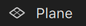

# Screen


**Screen** is a Spark AR script utility for the following purpose:

1. Convert coordinate **World Position**, **Canvas Position**, **Face Position** to **Focal Plane Position**.
2. Positioning 3D object (e.g. ) by percent `[0-1]`.
3. Scale 3D object to fit different screen size.


## Install

### Import

0. [Download Screen.js](https://github.com/pofulu/sparkar-screen/raw/master/Screen.js) (Right click and Save as)

1. Drag/Drop or import it to Spark AR.

2. Load in the required module.

    ```javascript
    const Screen = require('./Screen');
    ```

3. You can also [Click Here to Download Sample Projects (v101)](https://raw.githubusercontent.com/pofulu/sparkar-screen/master/ScreenDemo.arprojpkg).

### npm

0. Add package with `yarn` or `npm`.

    ```shell
    yarn add sparkar-screen
    ```

    or

    ```shell
    npm i sparkar-screen
    ```

1. Load in the required module.

    ```javascript
    const Screen = require('sparkar-screen');
    ```


## Usage 

### Convert Tracker's Position

```js
const FaceTracking = require('FaceTracking');
const Screen = require('./Screen');

const face = FaceTracking.face(0);
const feature = face.cameraTransform.applyToPoint(face.leftEye.center);

(async function () {
    const position = await Screen.cameraTransformToFocalDistance(feature);
    const focalPlanePosition = await Screen.cameraTransformToFocalPlane(feature);
    const canvasPosition = await Screen.cameraTransformToCanvas(feature);
});
```


### Positioning with Percent

```javascript
const Scene = require('Scene');
const Screen = require('./Screen');

(async function () {
    const positioning = await Scene.root.findFirst('positioning');
    positioning.transform.x = await Screen.percentToFocalPlaneX(.1);
    positioning.transform.y = await Screen.percentToFocalPlaneY(.2);
});
```


### Scale Object by Screen Size

It's recommanded to use this with percentage positioning.

```js
const Scene = require('Scene');
const Screen = require('./Screen');

(async function () {
    const scaler = Screen.createScaler(9, 16);
    const scaleTarget = await Scene.root.findFirst('scaleTarget');
    scaler.autoScaleObject(scaleTarget);
});
```


### Coordinate Converting Included

|                                  | World Position | Canvas Position | Focal Plane Position | Percentage Position |
| -------------------------------- | -------------- | --------------- | -------------------- | ------------------- |
| **World Position to**            |                | ✔               | ✔                    |                     |
| **Camera Transform Position to** | ✔              | ✔               | ✔                    |                     |
| **Canvas Position to**           | ✔              |                 | ✔                    | ✔                   |
| **Focal Plane Position to**      |                | ✔               |                      | ✔                   |
| **Percent Position to**          |                | ✔               | ✔                    |                     |


## Donations

If this is useful for you, please consider a donation🙏🏼. One-time donations can be made with PayPal.

[](https://www.paypal.com/cgi-bin/webscr?cmd=_s-xclick&hosted_button_id=HW99ESSALJZ36)

